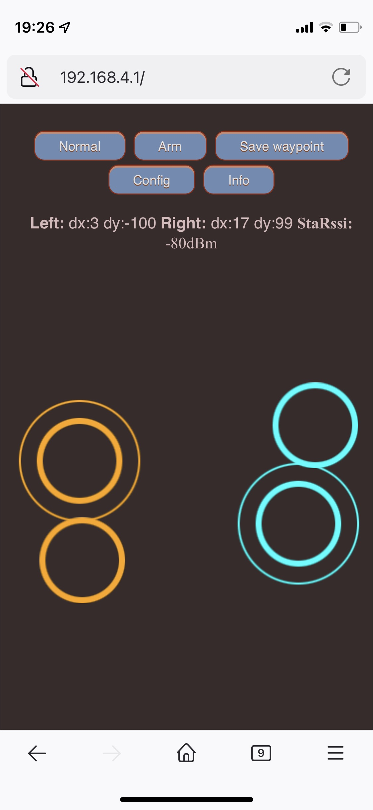

# fenceless-robotic-lawnmower

## TODO
- [ ] Bridge AP and STA https://github.com/espressif/esp-gateway

## Apps

* Base
* Mower

### WiFi Remote Control

 

## Scrapbook:

* Board definition: https://github.com/platformio/platform-espressif32/blob/master/boards/esp32-s3-devkitc-1.json
* Circle distance between two points: https://en.wikipedia.org/wiki/Haversine_formula

## Credits:

* Mars Rover: https://github.com/jakkra/Mars-Rover