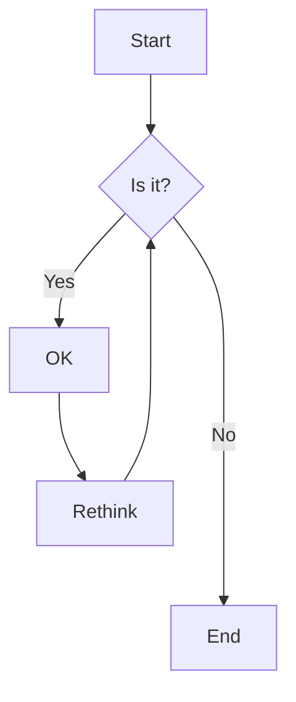

# fenceless-robotic-lawnmower

[](https://github.com/ldab/fenceless_robotic_lawnmower/releases/latest)

[](https://github.com/ldab/fenceless_robotic_lawnmower/blob/master/LICENSE)

[](https://github.com/ldab/fenceless_robotic_lawnmower)

## TODO
- [ ] Bridge AP and STA https://github.com/espressif/esp-gateway

## Apps

* Base
* Mower

## Concept



### WiFi Remote Control

 

## Mission Planner

Use [Mission Planner](Mission Planner: https://ardupilot.org/planner/#) in order to rout the area to be covered:

 


File format is:

```
QGC WPL <VERSION>\r\n
<INDEX>\t<CURRENT WP>\t<COORD FRAME>\t<COMMAND>\t<PARAM1>\t<PARAM2>\t<PARAM3>\t<PARAM4>\t<PARAM5/X/LATITUDE>\t<PARAM6/Y/LONGITUDE>\t<PARAM7/Z/ALTITUDE>\t<AUTOCONTINUE>\r\n
```

https://mavlink.io/en/file_formats/

## Scrapbook:

* Board definition: https://github.com/platformio/platform-espressif32/blob/master/boards/esp32-s3-devkitc-1.json
* Circle distance between two points: https://en.wikipedia.org/wiki/Haversine_formula

## Credits:

* Mars Rover: https://github.com/jakkra/Mars-Rover
* Badges by [shields.io](https://shields.io/)